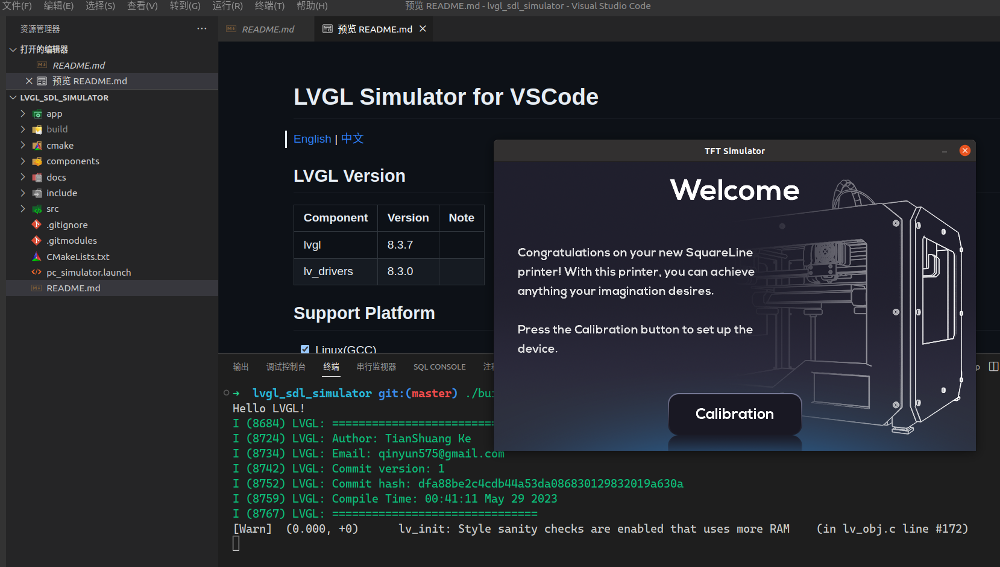

# LVGL Simulator for VSCode

[English](README.md) | [中文](README_CN.md)

## LVGL Version

| Component | Version | Note |
| :--- | :--- | :--- |
| lvgl | 8.3.7 | |
| lv_drivers | 8.3.0 | |



## Support Platform

- [x] Linux(GCC)
- [x] MacOS(GCC)
- [ ] Windows(MinGW)

## Get started
- Install a compiler and related tools if you don't have them yet:
  - On Windows [MinGW](https://www.mingw-w64.org/) can be a good choice
  - On Linux type in the Terminal: `sudo apt-get install gcc g++ gdb build-essential`
  - On MacOS install latest Xcode
- Install SDL (required to simulate a display)
  - On Windows see for example [this guide](https://www.caveofprogramming.com/c-for-complete-beginners/setting-up-sdl-windows.html)
  - On Linux `sudo apt-get install libsdl2-dev`
  - On MacOS install for example via Homebrew: `brew install sdl2` (To install Homebrew follow [the guide here](https://brew.sh/))
- Download and Install Visual Studio Code from [https://code.visualstudio.com/download])

## Build && Run

### Install software dependencies

- Linux
    - gcc
    - make/ninja-build
    - CMake
    - SDL2
- MacOS
    - gcc
    - make/ninja-build
    - CMake
    - SDL2
- Windows
    - gcc
    - make/ninja-build
    - CMake
    - SDL2

### Build

Use make

```shell
mkdir build && cd build
cmake ..
make -j$(nproc)
```

Or use ninja

```shell
mkdir build && cd build
cmake -G Ninja ..
ninja
```

### Run

```shell
# cd buid dir
./lvgl_app
```
